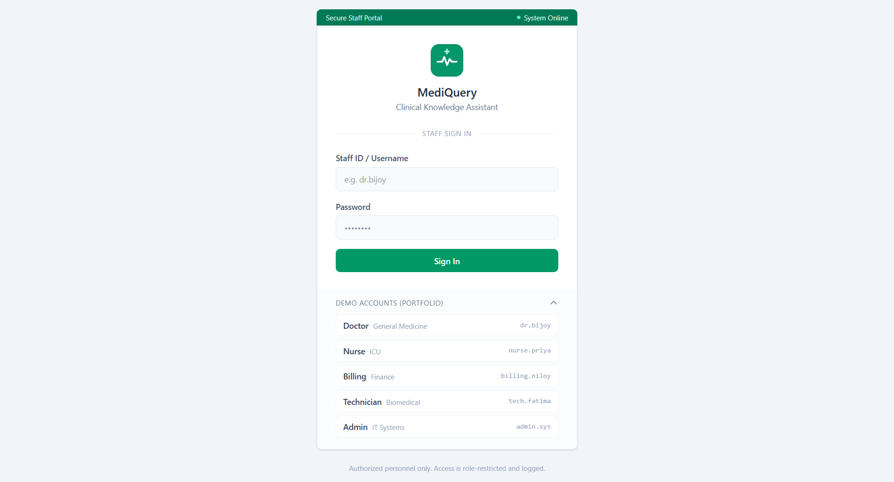
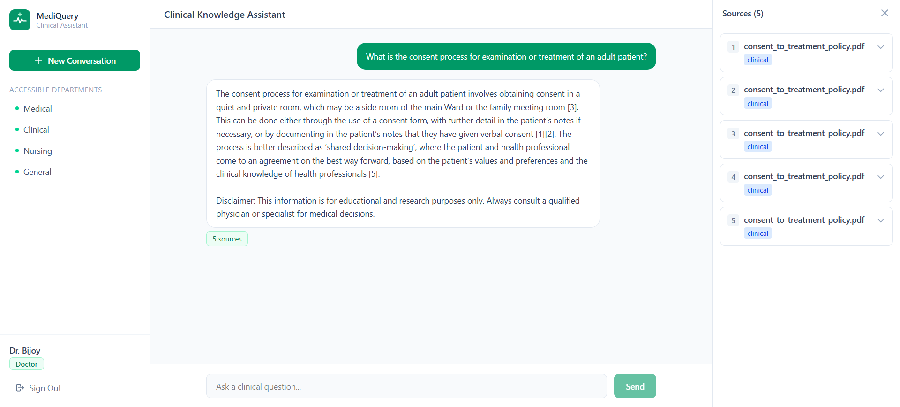
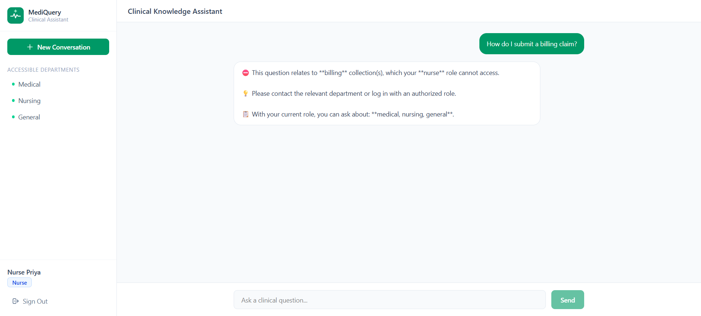
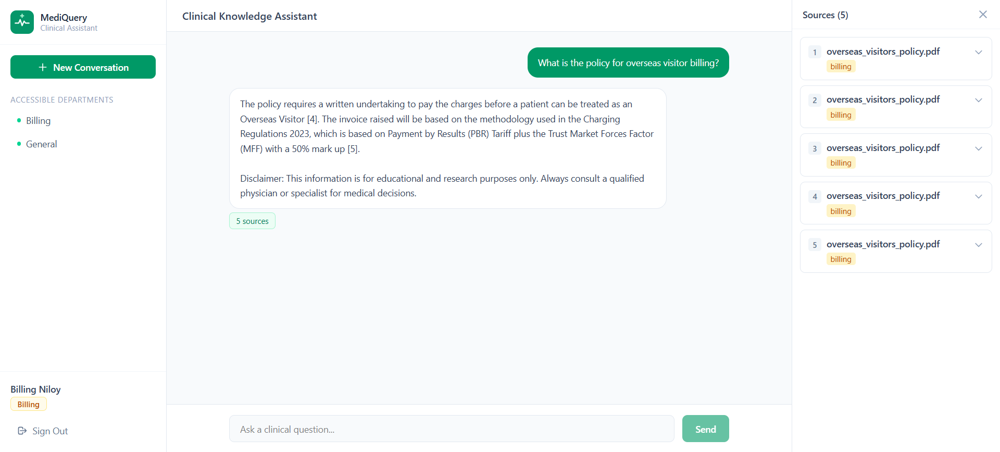
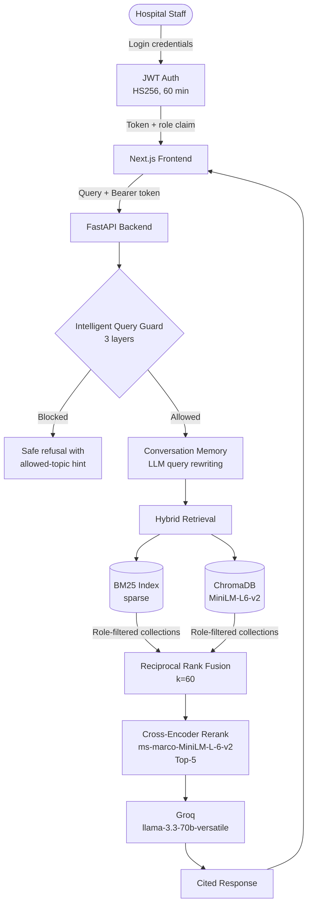

# MediQuery

> Role-gated medical knowledge assistant for hospital staff. Hybrid-retrieval RAG with JWT-based RBAC, query-time safety guards, and conversation-aware query rewriting — containerised end-to-end.


---

## Problem

A hospital's knowledge base is not one corpus — it is many. A nurse looking up an ICU procedure should not retrieve the billing department's claim-submission rules. A biomedical technician troubleshooting an infusion pump does not need the doctor's diagnostic reference. Mixing them creates noise at best, and surfaces role-inappropriate content at worst.

Most off-the-shelf RAG demos retrieve from a single flattened index and rely on prompt-level instructions to "stay on topic" — which any production team will tell you is brittle.

## Solution

**MediQuery** is a role-gated, multi-collection medical RAG system designed around the principle that **access control belongs at retrieval, not at generation**. Each user role can only see documents from collections it is explicitly authorised for, enforced server-side via JWT role claims *before* the retrieval pipeline runs.

Beyond access control, the system implements hybrid retrieval (sparse + dense + cross-encoder reranking), a three-layer query safety guard, and conversation-aware query rewriting — the moving parts of a production RAG pipeline, in one project.

---

## Demo

| Login | Doctor querying a clinical policy |
|---|---|
|  |  |

| Cross-role denial (Nurse → billing) | Billing user retrieving an authorised document |
|---|---|
|  |  |

The Nurse-role denial above is the system's RBAC enforcement working end-to-end: the Intelligent Query Guard classifies the topic as `billing`, checks it against the role's allowed collections, and refuses *before* any retrieval runs. No billing content is ever fetched, ranked, or shown.

---

## Architecture



---

## Features

- **Role-Based Access Control (RBAC).** JWT-bound role claims gate collection access *before* retrieval runs. A collection a role is not authorised for is never queried, never ranked, never reaches the LLM.
- **Hybrid Retrieval.** BM25 for lexical precision, dense embeddings for semantic recall, combined via Reciprocal Rank Fusion, then re-ranked with a cross-encoder for final ordering.
- **Intelligent Query Guard (three layers).** Pre-retrieval gating for out-of-scope queries, role-inappropriate topics, and prompt-injection patterns. On denial the user gets a clear refusal message and the list of topics they *can* ask about.
- **Conversation Memory via Query Rewriting.** Multi-turn context handled by LLM-based query rewriting, not raw history stuffing — keeps retrieval queries clean and focused.
- **Multi-Collection Knowledge Bases.** Six independent corpora (`medical`, `clinical`, `nursing`, `billing`, `equipment`, `general`) indexed separately and gated by role.
- **Cited Responses.** Source documents returned alongside the response so users can verify, not just trust.
- **Containerised End-to-End.** Single-command bring-up via `docker-compose`, with the backend image bundling pre-built indexes and pre-downloaded models for fast cold starts.

---

## Role-Based Access Matrix

| Role | Department | Accessible Collections |
|---|---|---|
| **Doctor** | General Medicine | `medical`, `clinical`, `nursing`, `general` |
| **Nurse** | ICU | `medical` (filtered), `nursing`, `general` |
| **Billing Executive** | Finance | `billing`, `general` |
| **Technician** | Biomedical | `equipment`, `general` |
| **Admin** | IT Systems | All six collections |

**Nurse-role additional filter.** The Nurse role has a semantic filter on top of collection gating — on the `medical` collection, only query intents of type `information`, `symptoms`, `prevention`, `considerations`, or `frequency` are answered. Diagnostic and treatment-recommendation queries fall outside nursing scope and are refused.

---

## Tech Stack

| Layer | Choice |
|---|---|
| Backend | FastAPI |
| Frontend | Next.js 16 (App Router) + Tailwind CSS |
| Vector store | ChromaDB |
| Sparse retrieval | BM25 (`rank_bm25`) |
| Embedding model | `sentence-transformers/all-MiniLM-L6-v2` |
| Reranker | `cross-encoder/ms-marco-MiniLM-L-6-v2` |
| Generation | Groq + `llama-3.3-70b-versatile` |
| Auth | JWT (HS256) |
| Code quality | Ruff + Gitleaks (pre-commit + CI) |
| Testing | pytest |
| Container | Docker + Docker Compose |
| CI | GitHub Actions |

---

## Project Structure

```
MediQuery/
├── .github/
│   └── workflows/
│       └── ci.yml              # Lint, tests, secret scan on push/PR
├── backend/
│   ├── api/                    # FastAPI routes, schemas, app entry
│   ├── auth/                   # JWT handler, role definitions, RBAC dependencies
│   ├── generation/             # Groq LLM client wrapper
│   ├── ingestion/              # MedQuAD parser + corpus indexer
│   ├── pipeline/               # End-to-end RAG orchestration
│   ├── retrieval/              # BM25, semantic (Chroma), hybrid (RRF), reranker
│   ├── config.py               # Single source of truth for paths + hyperparameters
│   └── Dockerfile
├── frontend/
│   ├── src/
│   │   ├── app/                # Next.js App Router pages
│   │   ├── components/         # ChatMessage, RoleBadge, SourceCard, ExampleQueries
│   │   └── lib/api.js          # Typed API client
│   └── Dockerfile
├── data/
│   ├── billing/                # NHS Trust financial policies
│   ├── clinical/               # NHS Trust clinical policies
│   ├── nursing/                # NHS Trust nursing policies
│   ├── equipment/              # NHS Trust equipment & facility policies
│   ├── general/                # NHS Trust HR & conduct policies
│   ├── medical/                # MedQuAD QA corpus (JSON)
│   ├── raw/MedQuAD/            # Raw MedQuAD archive (gitignored)
│   └── SOURCES.md              # Full data attribution
├── tests/
│   ├── conftest.py             # Shared fixtures (test client, role tokens)
│   ├── test_auth.py            # User store, JWT, /login endpoint
│   ├── test_roles.py           # RBAC matrix, Nurse qtype filter
│   └── test_api_smoke.py       # /health, /collections (local-only, needs index)
├── docs/
│   └── screenshots/            # Demo screenshots
├── .env.example
├── .pre-commit-config.yaml
├── docker-compose.yml
├── pytest.ini
├── requirements.txt            # Production dependencies
├── requirements-dev.txt        # Development dependencies (pytest, ruff)
└── LICENSE
```

---

## Setup

### Option 1: Docker (recommended)

The simplest path. Brings up both services with a single command.

**Prerequisites:**
- Docker + Docker Compose
- A Groq API key — [console.groq.com](https://console.groq.com)
- ~8 GB free disk (backend image bundles indexes + models, ~4 GB)
- ~6 GB RAM available at runtime

```bash
# 1. Clone the repo
git clone https://github.com/himelds/MediQuery.git
cd MediQuery

# 2. Configure environment
cp .env.example .env
# Edit .env and add GROQ_API_KEY + JWT_SECRET_KEY

# 3. Build the corpus (one-time, on the host)
python -m backend.ingestion.parse_medquad
python -m backend.ingestion.index_corpus

# 4. Bring up the stack
docker-compose up --build
```

First build takes 5–10 minutes (PyTorch + transformers + ChromaDB pulled into the backend image, models pre-downloaded). Subsequent runs start in seconds.

- Backend API: `http://localhost:8000` · Interactive docs: `http://localhost:8000/docs`
- Frontend: `http://localhost:3000`

### Option 2: Run locally without Docker

**Prerequisites:**
- Python 3.11+ (conda recommended)
- Node.js 20+
- A Groq API key

**Backend:**

```bash
conda create -n mediquery python=3.11 -y
conda activate mediquery
pip install -r requirements.txt

cp .env.example .env
# Edit .env: GROQ_API_KEY + JWT_SECRET_KEY

python -m backend.ingestion.parse_medquad
python -m backend.ingestion.index_corpus

python -m uvicorn backend.api.main:app --reload
```

**Frontend** (in a second terminal):

```bash
cd frontend
npm install
cp .env.example .env.local        # set NEXT_PUBLIC_API_URL=http://localhost:8000
npm run dev
```

---

## Development

Install development tooling (pytest, ruff):

```bash
pip install -r requirements-dev.txt
```

**Run the test suite:**

```bash
# All unit tests (auth + RBAC) — fast, no external dependencies
pytest tests/test_auth.py tests/test_roles.py

# API smoke tests — require a built local index (run the ingestion steps first)
pytest tests/test_api_smoke.py

# Everything
pytest
```

**Lint:**

```bash
ruff check backend tests
```

**Pre-commit hooks** (Ruff + Gitleaks + standard hygiene checks):

```bash
pre-commit install
pre-commit run --all-files
```

GitHub Actions runs lint + unit tests + a Gitleaks secret scan on every push and pull request — see `.github/workflows/ci.yml`.

---

## Demo Credentials

| Username | Password | Role |
|---|---|---|
| `dr.bijoy` | `doctor123` | Doctor |
| `nurse.priya` | `nurse123` | Nurse |
| `billing.niloy` | `billing123` | Billing Executive |
| `tech.fatima` | `tech123` | Technician |
| `admin.sys` | `admin123` | Admin |

> ⚠️ Demo-only credentials backed by an in-memory user store. Not for any environment with real data.

---

## Example Queries

- **Doctor** — *"What is the consent process for examination or treatment of an adult patient?"*
- **Nurse** — *"What are the symptoms of catheter-associated UTI?"* (in-scope) · *"How do I submit a billing claim?"* (denied)
- **Billing** — *"What is the policy for overseas visitor billing?"*
- **Technician** — *"What are the safety requirements for medical gas systems?"*

**Cross-role test (denied at retrieval).** A Billing user asking about a clinical diagnosis retrieves nothing from `clinical` — the collection is filtered out *before* retrieval runs, so the LLM never sees it.

---

## Configuration Reference

Key parameters in `backend/config.py`:

| Setting | Value | Notes |
|---|---|---|
| `TOP_K` | 20 | Candidates pulled per retriever before fusion |
| `RRF_K` | 60 | RRF smoothing constant (standard default) |
| `RERANK_TOP_K` | 5 | Documents passed to the LLM after reranking |
| `CHUNK_SIZE` | 500 | Tokens per chunk |
| `CHUNK_OVERLAP` | 50 | Token overlap between adjacent chunks |
| `LLM_TEMPERATURE` | 0.1 | Low for factual responses |
| `JWT_EXPIRY_MINUTES` | 60 | Token lifetime |

---

## Data Sources and Licensing

This project uses two corpora, both with permissive licensing for reuse:

- **Operational documents** (`billing/`, `clinical/`, `equipment/`, `general/`, `nursing/`) — curated from publicly available policy publications by **University Hospitals Plymouth NHS Trust** under the UK [Open Government Licence v3.0](https://www.nationalarchives.gov.uk/doc/open-government-licence/version/3/), which permits free reuse subject to attribution.
- **Medical QA corpus** (`medical/corpus.json`) — derived from **MedQuAD** (U.S. National Library of Medicine), public domain.

Full per-document attribution is in [`data/SOURCES.md`](data/SOURCES.md).

> This is a portfolio project. The system is not affiliated with University Hospitals Plymouth NHS Trust, the U.S. National Library of Medicine, or any other organisation referenced in the source documents.

---

## License

MIT — see [`LICENSE`](./LICENSE).

---

## Contact

**Himel Das** — <!-- replace placeholders below before commit -->

- Email: himeldas077@gmail.com
- LinkedIn: https://www.linkedin.com/in/dashimel/

---

## Acknowledgments

- **University Hospitals Plymouth NHS Trust** for the operational policy corpus, made available under the Open Government Licence v3.0
- **MedQuAD** (U.S. National Library of Medicine) for the medical QA corpus
- **Groq** for hosted LLM inference
- Open-source models from **Sentence Transformers** and the **Hugging Face** ecosystem
